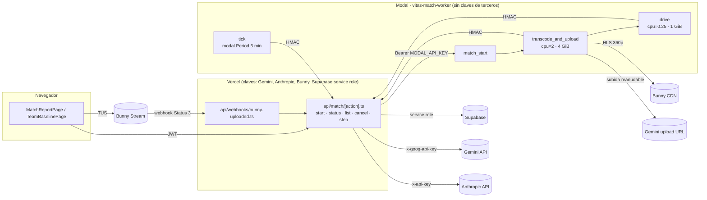
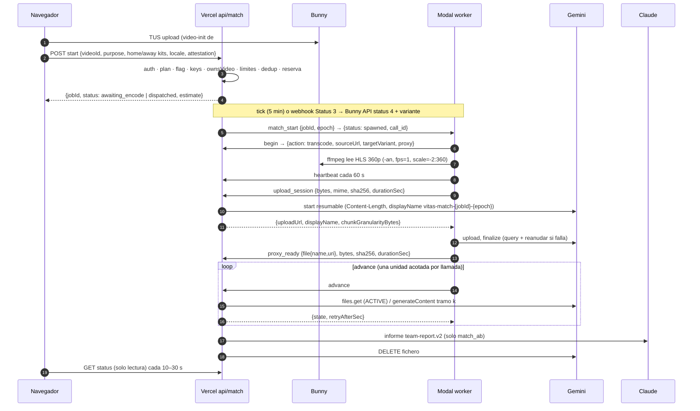

# Diseño · Partido completo por vídeo (Fase 1)

**Estado:** diseño final de la Fase 1 + contrato compartido (PR-0, rama `feat/match-job-contract`).
**Fuente de verdad de tipos y formas JSON:** `src/lib/shared/matchJob/contract.ts`
(tests: `src/test/lib/matchJobContract.test.ts` y
`api/_lib/__tests__/matchStepHmac.test.ts`). Si este documento y el contrato
discrepan, manda el contrato y se corrige este documento.

Este documento incorpora el diseño original y **todas** las correcciones de la
revisión adversarial (bloqueantes, correcciones, omisiones y violaciones de
invariantes). Donde chocaban, gana la revisión.

---

## 0. Decisiones del owner (cerradas)

> **Actualización 2026-09-29 (sustituye a la decisión 1 en lo que choque).** Un spike
> sobre un partido real del owner (Veo follow-cam, sub-10 fútbol 8, tramo de 15 min)
> mostró que Gemini 2.5 Flash viendo el vídeo a 1 fps **fabrica** eventos de equipo: 0
> de 5 tiros citados existían en el segundo citado (verificado con fotogramas), los
> eventos llegaban en pasos plantilla de ~10 s, la posesión salió 50/50 a LOW y citó
> dorsales inexistentes («#11» en un equipo sin números). Decisión: **se construye
> toda la infraestructura de la Fase 1 pero el análisis queda APAGADO hasta que pase
> una validación** (§20):
> - `MATCH_VIDEO_ENABLED` está apagado por defecto: solo el string exacto `"true"` lo
>   enciende. Apagado ⇒ `POST /api/match/start` responde `503 match_video_disabled`
>   con el motivo «análisis de partido completo en validación» (en el locale pedido) y
>   `GET /api/match/availability` devuelve `enabled:false` para que la UI muestre la
>   ruta de vídeo como **«En validación»** (deshabilitada, con el motivo) y deje el
>   informe con notas funcionando. Si se apaga con jobs en vuelo, el protocolo step
>   los detiene (`failed: analysis_disabled`, sin gasto nuevo, conservando lo ya
>   observado) y el tick sigue barriendo ficheros de Gemini.
> - Motor configurable y medible: longitud de tramo, fps enviados a Gemini
>   (`videoMetadata.fps` = `geminiVideoFps`, default 1, «pendiente de validar») y
>   resolución, todo en `config/matchVideo.json` con `_source`.
> - Arnés de validación `scripts/validate-match-observation.mjs` (§20).
> - La guarda de identidad descarta también cualquier texto que mencione números de
>   camiseta o a un solo jugador (§7).
> - La posesión sigue siendo `ESTIMADA_LLM` con su propio gate de baja confianza (§8).

1. **Se construye y se activa ya** *(activación sustituida por la actualización de
   arriba: se activa solo tras la validación)*. La función queda detrás de
   `MATCH_VIDEO_ENABLED === "true"` en el servidor **y** exige una casilla de
   declaración del entrenador:
   > «Declaro que tengo el consentimiento y los derechos para analizar este vídeo»

   El job guarda `attested_by` (id de usuario del JWT verificado, nunca del
   body), `attested_at` (reloj del servidor) y `attestation_version`
   (`MATCH_ATTESTATION_VERSION = "2026-09-28.v1"`). Sin declaración, o con una
   versión distinta de la vigente, `POST /api/match/start` responde
   `400 attestation_required`.
2. **Worker Modal solo CPU**, con límite de gasto del workspace de **$10/mes**
   (lo fija el operador). Sin GPU en la Fase 1.
3. **`GLOBAL_MONTHLY_BUDGET_USD = 20`** (lo fija el operador) y **reserva de
   coste por partido** obligatoria.
4. **El informe A-vs-B incluye posesión estimada (%) por equipo**, por tramo y
   agregada ponderando por segundos analizados. Siempre rotulada
   «Estimado por IA» (`ESTIMADA_LLM`), con confianza tomada de config y marcada
   `"pendiente de validar"`, nunca `MEDIDA` ni con aspecto de estadística
   oficial. Además, **dominio ordinal por tramo de 15 min** (local / equilibrado /
   visitante) y **evidencias con marca de tiempo**.

---

## 1. Prerrequisitos

| # | Qué | Estado |
|---|---|---|
| P1 | PR #287 (doble lectura del body) | mergeado (`65f8fb8`) |
| P1 | Allowlist de URLs de vídeo en servidor (#288) | mergeado (`ce1b889`) |
| P2–P4 | **PR #292 (Fase 0):** webhook Bunny corregido (`X-BunnyStream-Signature`, Status 3 = Finished), fila `videos` creada en `video-init` con el JWT del usuario, TUS 24 h + reanudación, `onUploaded`, `src/lib/shared/videoLimits.ts` (`MAX_MATCH_DURATION_MIN`, `MAX_UPLOAD_SIZE_MB`), enums de Bunny en `api/_lib/bunnyStream.ts` | abierto, **debe mergearse antes del PR de backend** |
| P5 | Cobertura RGPD de borrado (§13) | parte del PR de backend |
| P6 | Spike en **Modal** (no con ffmpeg local), resultados literales en `docs/pendientes-metricas.md` (§18) | operador |
| — | Rotación de credenciales C3 (el worker reutiliza el secret `vitas-api-key`) | operador, antes de datos reales |

`api/agents/video-observation.ts` **no se toca** en la Fase 1. La librería
Gemini nueva (`api/_lib/gemini/*`) nace aparte; la duplicación temporal del
código File API se anota como deuda conocida en `docs/pendientes-metricas.md`
(inv. #7) y se migra en la Fase 2.

---

## 2. Arquitectura

La máquina de estados vive en **Vercel + Supabase**, junto con todas las claves.
Un worker **Modal solo CPU** mueve bytes (transcodifica) y actúa de conductor
durable. Gemini ve un proxy pequeño (1 fps, sin audio) tramo a tramo. Claude
redacta el informe A-vs-B solo a partir de evidencias con marca de tiempo.
Los equipos se distinguen **solo** por los colores de equipación que declara el
usuario.



**Dónde vive cada secreto**

| Secreto | Vercel | Modal (`vitas-api-key`) | Navegador |
|---|---|---|---|
| `GEMINI_API_KEY` | sí (cabecera `x-goog-api-key`, nunca `?key=`) | **no** | no |
| `ANTHROPIC_API_KEY` | sí | no | no |
| `BUNNY_STREAM_API_KEY`, `SUPABASE_SERVICE_ROLE_KEY` | sí | no | no |
| `MODAL_API_KEY` (= `API_KEY` en Modal) | sí | sí | no |
| `MODAL_CALLBACK_SECRET` | sí | sí | no |
| `VITAS_PUBLIC_URL` (step URL = `+ /api/match/step`) o `VITAS_MATCH_STEP_URL` (URL completa, tiene prioridad) | — | sí (el worker **nunca** toma la URL de la petición) | — |
| `BUNNY_CDN_HOSTNAME` (+ `VIDEO_URL_EXTRA_HOSTS`) | sí | sí (allowlist de hosts de origen, ya exigida por #288) | — |

La URL de subida reanudable de Gemini es una **URL de capacidad** que acuña
Vercel con la clave en cabecera; la clave no sale de Vercel (regla 3 de
CLAUDE.md). El worker la trata como secreto (no se registra en logs).

---

## 3. Flujo extremo a extremo (partido de 90 min, locale del job)



1. **Entrada** (`/equipo/partido`, `/equipo/baseline`). El entrenador declara
   nombre y **color de camiseta obligatorio** de cada equipo (selector + etiqueta
   opcional; pantalón y portero opcionales). Opcionales: dirección de ataque del
   local en la 1.ª parte, notas («aportado por el entrenador, no observado»),
   **categoría explícita** (`youth` | `senior`, sin valor por defecto). Casilla de
   declaración obligatoria. `team_baseline` exige `focusTeam` y el color propio;
   el del rival es opcional.
2. **Subida** navegador → Bunny por TUS (PR #292). El job arranca con
   `onUploaded`, sin esperar al encode.
3. **Start** (§5). Inserta `match_analyses` en `awaiting_encode` (o despacha ya
   si Bunny está en Finished con la variante objetivo).
4. **Espera de encode** (el encode gratuito de Bunny puede tardar horas): la
   despacha el **tick** de Modal cada 5 min o, como acelerador, el webhook
   corregido (Status 3). Ambas rutas son idempotentes.
5. **Despacho** Vercel → Modal `match_start` (§6.6). Se parsea la respuesta: sin
   `call_id` o con `status:"error"` es fallo (arregla el patrón zombi de
   `api/coaching/_track-async.ts`).
6. **Worker**: `begin` → ffmpeg → `upload_session` → subida → `proxy_ready` →
   bucle `advance` en una función aparte de 0,25 cores.
7. **Vercel advance** hace exactamente una unidad acotada e idempotente por
   llamada (`gemini_processing` → `observing` tramo a tramo → `aggregating` →
   `reporting` → `completed` con borrado del fichero Gemini).
8. **UI** consulta `GET /api/match/status` (solo lectura) cada 10 s con
   retroceso a 30 s; `?job=<id>` y `GET /api/match/list` recuperan el job tras
   recargar (el encode puede durar horas).
9. **Baseline**: `/api/team/baseline-analysis` acepta `matchAnalysisId`, verifica
   la propiedad del job y carga la observación del equipo foco en servidor. Pasa a
   runtime **nodejs con `maxDuration` 300** (en Edge debía empezar a responder en
   25 s y hace 5 llamadas a Claude). Desaparecen la llamada síncrona de 120 s y el
   `playerContext {age:13}` inventado de `TeamBaselinePage`.

---

## 4. Máquina de estados

Estados (`MATCH_JOB_STATUSES`) y transiciones legales (`MATCH_JOB_TRANSITIONS`,
el `stateMachine.ts` del backend lanza ante cualquier otra):

| Desde | Hacia |
|---|---|
| `awaiting_encode` | `dispatched`, `failed` (encode_failed / encode_timeout), `cancelled` |
| `dispatched` | `preparing`, `failed` (dispatch_exhausted), `cancelled` |
| `preparing` | `uploading`, `dispatched` (re-despacho), `failed`, `cancelled` |
| `uploading` | `gemini_processing`, `dispatched` (re-despacho), `failed`, `cancelled` |
| `gemini_processing` | `observing`, `dispatched` (fichero caducado), `failed` (FAILED), `cancelled` |
| `observing` | `aggregating`, `dispatched` (fichero caducado), `failed` (budget_exhausted…), `cancelled` |
| `aggregating` | `reporting` (match_ab con ≥1 tramo analizado), `completed` (team_baseline, o 0 tramos → informe bloqueado), `failed`, `cancelled` |
| `reporting` | `completed`, `failed`, `cancelled` |
| `completed` / `failed` / `cancelled` | — (terminales) |

**Epoch (fencing).** `dispatch_epoch` empieza en 0 y sube en cada despacho (el
primer worker recibe `epoch = 1`). Toda op por job lleva `{jobId, epoch}`; si
`epoch !== dispatch_epoch` la respuesta es `{superseded: true}` y el worker sale.
El re-despacho es ortogonal a la tabla:
- `preparing | uploading` → `dispatched` (se rehace el transcode);
- `gemini_processing | observing` → `dispatched` **solo** si el fichero Gemini
  caducó (48 h) o se perdió (también cuando Gemini responde 404 / `file_unavailable`
  aunque la BD aún lo tenga adjunto y sin caducar: se limpian sus campos y se
  re-transcodifica); los tramos hechos se conservan y **no se refacturan**;
- `dispatched | gemini_processing | observing | aggregating | reporting` con el
  fichero aún `ACTIVE` → mismo estado, `epoch++`, y `begin` responde
  `action: "advance"` (se salta el transcode).

Máximo `MATCH_MAX_DISPATCH_ATTEMPTS = 3` despachos por job; al agotarse,
`failed: dispatch_exhausted` conservando lo ya observado (los tramos hechos, ya
facturados, se agregan con su cobertura real; los abiertos pasan a `skipped`).

**Etapas de UI** (`MATCH_STATUS_TO_STAGE`): `encoding` («Bunny procesando, puede
tardar horas») → `preparing` («Preparando vídeo») → `analysing` («Analizando tramo
k/n · tiempo de vídeo mm:ss–mm:ss») → `reporting` («Redactando informe») → `done`
| `failed` | `cancelled`. No hay barra de % inventada: el progreso es la etapa +
`segmentsDone/segmentsTotal` (null hasta planificar los tramos).

---

## 5. API de usuario

Rutas (`MATCH_API_ROUTES`), router `api/match/[action].ts` (runtime nodejs,
`maxDuration` 300). Envoltorio estándar: `{ ok: true, data }` /
`{ ok: false, error: { code, message } }`.

### 5.1 `POST /api/match/start` (JWT de usuario)

Orden de comprobaciones:

1. `requireAuth` **sin** `allowServiceToken` + `requiredPlan` de `withHandler`
   (fail-closed).
2. `matchStartRequestSchema` (zod estricto: una clave desconocida como
   `playerContext` o `players` es 400) → `invalid_input` / `attestation_required`.
3. `MATCH_VIDEO_ENABLED === "true"` → si no, `503 match_video_disabled`. Presencia
   de `GEMINI_API_KEY`, `BUNNY_STREAM_API_KEY`, `BUNNY_STREAM_LIBRARY_ID`,
   `BUNNY_CDN_HOSTNAME`, `MODAL_MATCH_START_URL`, `MODAL_API_KEY`,
   `MODAL_CALLBACK_SECRET` y Supabase service role → si falta alguna,
   `503 real_inference_disabled` con `details.missing` = **nombres** de variables,
   nunca valores. (`ANTHROPIC_API_KEY` no bloquea: sin ella el informe se abstiene.)
4. Cargar la fila `videos` (service role) y `ownsVideo(fila, userId, tenantId)`
   → `404 video_not_found` / `403 not_owner`. `bunny_video_id` se copia de la fila
   propia.
5. Leer la **API de Bunny** (nunca `videos.duration`, contaminada con `?? 0` por el
   cliente): `length` > `MAX_MATCH_DURATION_MIN` (de `videoLimits.ts`) →
   `422 video_too_long`. Si aún no hay `length` (encode pendiente), la reserva se
   calcula con el tope `MAX_MATCH_DURATION_MIN` (`basis: "max_duration_cap"`) y se
   recalcula al despachar.
6. **Dedup**: job activo del mismo vídeo + purpose + kits → se devuelve con
   `deduplicated: true`.
7. **Concurrencia**: 1 job activo por usuario (índice único parcial en BD, ver
   §10) + tope global pequeño (`maxActiveJobsGlobal`, config) → `429 concurrency_limit`.
8. **Presupuesto**: `wouldExceedBudget(estimate)` = gastado del mes + reservas de
   jobs activos + estimación ≥ `GLOBAL_MONTHLY_BUDGET_USD` → `429 budget_exceeded`
   con `details.estimate`.
9. Insertar (service role) con los campos de declaración; `awaiting_encode`, o
   despachar ya si Bunny está en Finished con la variante.

Respuesta: `matchStartResponseSchema` → `{ jobId, status, deduplicated, estimate }`.

### 5.2 `GET /api/match/status?jobId=` (solo lectura, CWE-650)

Solo el dueño. **Nunca** despacha, nunca llama a Gemini ni a Claude, nunca
escribe (lección del demo decide: un GET no muta ni gasta). Puede **leer** la API
de Bunny para `encode` (estado + `encodeProgress`, dato operativo, no métrica).
Sustituye el sondeo de `api/videos/_status.ts`, que no comprueba propiedad.
Respuesta: `matchJobStatusResponseSchema` → `job`, `progress`, `encode`,
`playback` (URL base del embed de Bunny acuñada en servidor), `coverage`,
`observation`, `report`, `reportGate`, `error`, `cost {estimate, spend}`.

### 5.2-bis `GET /api/match/availability?locale=` (solo lectura)

`matchAvailabilityResponseSchema` → `{ enabled, code, reason }`. `code` =
`match_video_disabled` (flag apagado: «en validación») o `real_inference_disabled`
(flag encendido pero configuración incompleta); `reason` en el locale pedido. No lista
nombres de variables. La UI lo consulta antes de ofrecer la ruta de vídeo.

### 5.3 `GET /api/match/list` · `POST /api/match/cancel`

`list`: los últimos jobs del usuario (`matchJobListResponseSchema`). `cancel`:
el dueño pasa cualquier estado no terminal a `cancelled`; se borra el fichero
Gemini (el barrido es respaldo) y el worker se entera por la respuesta de su
siguiente op (`stop` / estado terminal).

---

## 6. Protocolo worker ↔ Vercel (`POST /api/match/step`)

### 6.1 Firma HMAC

- Cabeceras: `X-Vitas-Timestamp` = segundos unix (10 dígitos) y
  `X-Vitas-Signature` = `hex(HMAC_SHA256(MODAL_CALLBACK_SECRET, ts + "." + rawBody))`
  en minúsculas.
- Se firma el **cuerpo completo** tal cual se envía (bytes UTF-8), nunca una
  re-serialización. Mismo patrón de contenido que `api/webhooks/modal-tracking.ts`,
  pero con timestamp: una firma de solo cuerpo (esquema de modal-tracking) **no**
  vale aquí.
- Ventana `|now − ts| ≤ 300 s` (`STEP_SIGNATURE_WINDOW_SEC`), comparación en tiempo
  constante (`timingSafeEqual` de `api/_lib/edgeCrypto.ts`), fail-closed: sin
  secreto → 503; firma, timestamp o cuerpo inválidos → 401. `withHandler` con
  `rawBody: true` y `requireAuth: false`; sin `allowServiceToken`.
- Un replay dentro de la ventana es inocuo: toda op es idempotente y está
  protegida por epoch y lease.

**Vectores de prueba** (`STEP_HMAC_TEST_VECTORS` en el contrato; secreto de
prueba `vitas-test-secret-not-a-real-key`; calculados con `node:crypto`,
verificados también con Python `hmac` y con el helper Web Crypto de Vercel):

| ts | cuerpo (bytes UTF-8) | firma |
|---|---|---|
| `1790000000` | `{"op":"advance","jobId":"8f6d2c1e-3b4a-4c5d-9e8f-0a1b2c3d4e5f","epoch":1}` (73 B) | `98ae526b57a69637dcfee55258c077005abc9ed955c868cef3627a7d3b82353c` |
| `1790000300` | `{"op":"fail","jobId":"8f6d2c1e-3b4a-4c5d-9e8f-0a1b2c3d4e5f","epoch":2,"code":"transcode_failed","reason":"ffmpeg salió con código 1: sin señal de vídeo"}` (157 B) | `b1b460ada7e65771fc55ef6ba67cf9c4c3f7600101f0be53b773905d3db127d2` |

En Python: `body = json.dumps(obj, separators=(",", ":"), ensure_ascii=False).encode("utf-8")`;
`hmac.new(secret, ts.encode() + b"." + body, hashlib.sha256).hexdigest()`.

### 6.2 Ops

Todas las ops por job llevan `{op, jobId, epoch}`; `tick` es la única global y
lleva `jobId: null, epoch: null`. Cualquier op por job puede recibir
`{superseded: true}`.

| op | cuándo | petición (además de `op/jobId/epoch`) | respuesta `data` |
|---|---|---|---|
| `begin` | al arrancar | — | `{action:"transcode", epoch, sourceUrl, sourceUrlExpiresAt, targetVariant, expectedDurationSec, proxy}` · `{action:"advance", epoch}` (fichero ACTIVE: saltar transcode) · `{action:"stop", epoch, state}` |
| `heartbeat` | cada 60 s durante ffmpeg y subida | `phase: transcoding\|uploading`, `processedSec?`, `uploadedBytes?` | `{action:"continue"\|"stop", state}` |
| `upload_session` | **después** de ffmpeg | `bytes`, `mime:"video/mp4"`, `sha256` (hex minúsculas), `durationSec` (ffprobe) | `{uploadUrl, displayName, chunkGranularityBytes}` |
| `proxy_ready` | tras `upload, finalize` | `file{name:"files/…", uri}`, `bytes`, `sha256`, `durationSec` | `{state}` (idempotente por sha256; epoch obsoleto → Vercel borra ESE fichero) |
| `advance` | en bucle | — | `{state, retryAfterSec}` (0–300) |
| `fail` | error del worker | `code` (`WORKER_FAIL_CODES`), `reason` (≤1000, sin URLs ni tokens) | `{state}` |
| `tick` | `modal.Period(minutes=5)` | `scheduledAt` | `{dispatched, redispatched, failedJobs, geminiFilesDeleted, geminiDeleteErrors, more}` |

Detalles vinculantes:
- `sourceUrl` = playlist HLS de la **variante más pequeña ≥ 360p**, construida en
  servidor **solo** desde `bunny_video_id` + `BUNNY_CDN_HOSTNAME` (firmada si el
  pull zone tiene token auth) y validada por `api/_lib/videoUrlGuard.ts`. Nunca una
  URL del cliente. El formato exacto de la ruta HLS se confirma en el spike (h).
- `proxy` (`proxySpecSchema`): `mp4`, `h264`, **`audio: false` siempre** (no se
  envían voces de menores a Google ni se pagan tokens de audio), `fps`,
  `maxHeight`, `crf`, `durationToleranceSec` — valores de `config/matchVideo.json`.
  El worker no tiene configuración propia.
- `upload_session` va **después** del transcode porque el `start` reanudable de
  Gemini exige `X-Goog-Upload-Header-Content-Length` (https://ai.google.dev/api/files).
  Vercel vuelve a comprobar `durationSec` contra el `length` de Bunny con
  `durationToleranceSec` (→ `duration_mismatch`) y el tamaño contra el límite por
  fichero de Gemini (→ `proxy_too_large`).
- `sha256` del worker va en hex; Gemini devuelve `sha256Hash` en base64 → Vercel
  compara tras decodificar.
- `uploadUrl` solo puede apuntar a `generativelanguage.googleapis.com`; `file.uri`
  igual. El worker rechaza cualquier otro host.

### 6.3 Unidad acotada de `advance` (Vercel)

- `gemini_processing`: `files.get`. `ACTIVE` → el planificador puro crea los tramos
  (`config.segmentSec` = 900 s, el último parcial) desde el `length` de Bunny;
  `FAILED` → `failed: gemini_file_failed`; si no, `retryAfterSec` 15. Sin tope de
  60 s.
- `observing`: reclamar el siguiente tramo `pending` (PATCH condicional o RPC con
  `SKIP LOCKED`, lease 280 s, `attempts < maxSegmentAttempts`); presupuesto
  comprobado **antes** de cada tramo; `generateContent` con `AbortController` de
  240 s; gasto **real** (usageMetadata × `config/aiPricing.json`) al ledger y a
  `spend_usd`. Dos `advance` simultáneos producen **una sola** llamada a Gemini.
  Un tramo `done` nunca se refactura.
- `aggregating`: puro y determinista (§8).
- `reporting`: Claude (§9).
- terminal: borrar el fichero Gemini y fijar `gemini_file_deleted_at`.

### 6.4 Comportamiento del worker

- `401` → salir (secreto desalineado). `400/404` → salir y registrar.
  `5xx/504`/red → reintento con retroceso (5, 10, 20, 40, 60 s) hasta un plazo
  global; al agotarlo, `fail {code:"deadline_exceeded"}` si es posible y salir (el
  tick re-despacha).
- `superseded` o `stop` o estado terminal → salir sin tocar nada (Vercel borra
  los ficheros de epochs obsoletos).
- Subida reanudable: `upload, finalize` en streaming (o trozos múltiplos de
  `chunkGranularityBytes`); si falla, `query` → `X-Goog-Upload-Size-Received` →
  reanudar desde ese offset.
- ffprobe debe cuadrar con `expectedDurationSec ± durationToleranceSec`; si no,
  `fail {code:"duration_mismatch"}`. Además: exactamente una pista h264 ≤ `maxHeight`
  y **sin audio** (si no, no se sube).
- **Continuidad** (verificado con ffmpeg 8.1: con un segmento HLS perdido ffmpeg sale
  con 0 y el filtro `fps` rellena el hueco con fotogramas repetidos, así que la
  duración cuadra): segmento HLS perdido → `source_unavailable`; más fotogramas
  repetidos que `floor(fps × durationToleranceSec)` o sin estadísticas del filtro
  → `transcode_failed`. Nunca llega a Gemini un proxy con imagen congelada.
- Receta y comprobaciones en `vision-pipeline/match_proxy.py` (una sola
  implementación: la usan el worker y el CLI local que genera el proxy del arnés de
  validación). Restricciones para `config/matchVideo.json`: `fps` de Gemini
  (`videoMetadata.fps`) ≤ `proxyFps`, y `durationToleranceSec` ≥ 1/`proxyFps`.
- Lógica mínima en Python. Los vectores HMAC se comprueban en los tests TS **y**
  en `vision-pipeline/test_match_worker.py` (Python `hmac`, cruzados con el
  contrato para detectar deriva); el job `Python tests (vision-pipeline)` de
  `.github/workflows/ci.yml` corre `python -m pytest vision-pipeline/test_*.py`
  (httpx + pytest, sin Modal ni red).

### 6.5 Funciones Modal (`vision-pipeline/match_worker.py`, app `vitas-match-worker`)

| Función | Recursos | Papel |
|---|---|---|
| `match_start` (web endpoint) | `cpu=0.125`, 256 MiB | Bearer `API_KEY` con `hmac.compare_digest`; cuerpo estricto `{jobId, epoch}`; comprueba que el secret tiene lo necesario; `spawn(transcode_and_upload, jobId, epoch)`; responde `{status:"spawned", call_id}` |
| `transcode_and_upload` | `cpu=(2, 2)`, `memory=4096`, `timeout=7200`, `retries=0`, `max_containers=2` | begin → allowlist + variante HLS → ffmpeg (receta de `match_proxy.py`) → heartbeat (hilo, 60 s) → continuidad + ffprobe → upload_session → subida → proxy_ready → `spawn(drive)` |
| `drive` | `cpu=0.25`, `memory=1024`, `timeout=10800`, `retries=0` | bucle `advance` hasta terminal / superseded (los cores reservados se facturan todo el tiempo de reloj: https://modal.com/pricing) |
| `tick` | `cpu=0.125`, 256 MiB, `modal.Period(minutes=5)`, `max_containers=1` | op=tick firmada |
| `spike_proxy` (+ `modal run …::spike`) | como `transcode_and_upload`, `max_containers=1` | solo operador: allowlist + proxy en Modal desde una URL de Bunny, **sin Vercel ni Gemini** (puntos (e) y (h) del §18 con el análisis apagado; copia opcional del proxy para el arnés) |

Imágenes ligeras (transcode: ffmpeg + httpx; resto: httpx + FastAPI). Sin claves
de Gemini, Anthropic, Supabase ni Bunny API. Allowlist de origen: la de #288
extraída a `vision-pipeline/video_url_guard.py` (inv. #7; `app.py` la importa),
solo `https`; el worker valida también la variante y cada segmento/clave de la
playlist antes de lanzar ffmpeg, y ffmpeg solo puede abrir `https,tls,tcp,crypto`.
Despliegue y checklist del secret: `vision-pipeline/README.md`.

### 6.6 Despacho Vercel → Modal

`POST MODAL_MATCH_START_URL` con `Authorization: Bearer <MODAL_API_KEY>` y
cuerpo `matchDispatchRequestSchema` = `{jobId, epoch}`. Solo
`{status:"spawned", call_id}` cuenta como éxito; `{status:"error"}`, un 2xx sin
`call_id` o cualquier otra cosa es fallo: se cuenta el intento y **no** se
registra gasto. Se guarda `modal_call_id`.

---

## 7. Gemini por tramo

- `parts`: `fileData{fileUri, mimeType:"video/mp4"}` +
  `videoMetadata{startOffset:"900s", endOffset:"1800s", fps: geminiVideoFps}` + prompt
  `segment.v1`. La petición completa la construye **una sola función**
  (`api/_lib/matchJob/segmentRequest.ts`), que usan el job y el arnés de validación:
  lo validado es exactamente lo que corre. `geminiVideoFps` (default 1, «pendiente de
  validar») nunca puede superar `proxyFps` (el loader de config lo exige).
- `generationConfig`: `temperature 0`, `mediaResolution MEDIA_RESOLUTION_LOW`,
  `responseMimeType application/json`, `responseSchema =
  SEGMENT_GEMINI_RESPONSE_SCHEMA` (subconjunto OpenAPI; su aceptación por
  `GEMINI_MODEL` se confirma en el spike (b)), `thinkingConfig.thinkingBudget` y
  `maxOutputTokens` de config.
- **Ambos equipos en una llamada** (los tokens de vídeo se pagan una vez). El
  prompt identifica a cada equipo **solo** por sus colores declarados (hex +
  etiqueta), prohíbe dorsales, números y nombres, y pide el texto en el **locale
  del job** (`languageDirective(locale)`; instrucciones en un solo idioma base).
  Categoría: si el job no la trae, se omite la directiva (nunca `resolveCategory`
  con su `"youth"` por defecto). A Gemini **no** se envían las notas del
  entrenador ni la plantilla.
- Forma de salida: `segmentObservationSchema` (todo `.strict()`):
  `team_identification` (clear | partial | ambiguous), `not_evaluable_intervals`,
  `possession_estimate {home_pct, away_pct, basis}` o null, `dominance`
  (home | balanced | away | null), por equipo `formation`, `phases`, `build_up`,
  `pressing` (altura e intensidad ordinales), `block`, `transitions`,
  `set_pieces`, `note`, y `evidence[{t_start, t_end, team, category, text}]`
  acotado. **Ningún campo individual.**
- Tras la llamada: si `usageMetadata.promptTokensDetails` existe y **no** trae tokens
  `VIDEO`/`IMAGE`, la IA respondió sin ver el tramo → tramo fallido
  (`no_visual_input`, como mucho 1 reintento), nada de él se usa. Después
  `identityGuard` (claves `INDIVIDUAL_LEVEL_KEYS` + texto `INDIVIDUAL_TEXT_PATTERNS`
  — dorsales, `#10`, «camiseta 7», «(10)», y desde el 2026-09-29 cualquier referencia
  a **un solo jugador**: «el jugador», «a player», «el portero», «the striker», «their
  captain» — + nombres de la plantilla del tenant y de las notas) descarta y cuenta;
  zod; normalización de tiempos a **tiempo de vídeo absoluto**
  (la regla absoluto/relativo sale del spike (d), se aplica una vez); evidencias
  fuera de `[start, end]` se descartan; `finishReason MAX_TOKENS` o JSON inválido
  = tramo fallido con motivo (nunca parseo parcial; como mucho 1 reintento).

---

## 8. Agregación, cobertura y procedencia

Todo lo que viene de Gemini o Claude es `ESTIMADA_LLM`, `calibrated: false`,
`source_ref = ${GEMINI_MODEL}@segment.v1#s{idx}[{start}-{end}s]` (o el modelo real
del informe). La confianza sale de config (`"pendiente de validar"`), **nunca**
del autoinforme del modelo, y baja en tramos `partial`. Nada es `MEDIDA`, nada
en metros, nada por jugador. PHV y bio-banding no se tocan.

**Posesión estimada (decisión 4 del owner).**
- Por tramo: válida solo si el tramo está `done`, `team_identification ≠
  ambiguous`, hay `possession_estimate` y `home_pct + away_pct = 100`. Si no, valor
  null con `gate_code` (`segment_failed`, `teams_ambiguous`, `possession_missing`,
  `possession_incoherent`) y `gate_reason` en el locale del job.
- Agregada: `Σ wᵢ·pᵢ / Σ wᵢ` sobre los tramos válidos, con `wᵢ` = segundos
  analizados del tramo; `home` redondeado a entero y `away = 100 − home`.
  **Sigue siendo `ESTIMADA_LLM`** (una función determinista sobre entradas LLM no
  es `DERIVADA`). Sin tramos válidos → null + `no_usable_segments`.
  `possession_detail` declara los tramos usados y excluidos.
- **Gate de baja confianza (actualización 2026-09-29).** El valor se conserva (es la
  estimación del modelo) pero su confianza baja a `possessionLowConfidence` (config,
  «pendiente de validar») y se declara el motivo
  (`possession_detail.low_confidence[]`, `segments[*].possession_low_confidence`,
  copiado al informe como `possession_low_confidence`):
  - `no_visual_basis`: el tramo no tiene base visual confirmada (el `usageMetadata`
    no confirma tokens de vídeo, o el tramo no cita ninguna evidencia);
  - `uniform_output`: **todos** los tramos utilizables salieron 50/50 con dominio
    «equilibrado» (o sin dominio): indistinguible de un valor por defecto.
  La confianza agregada es la menor de los tramos usados; Claude recibe la advertencia
  y no puede apoyar ninguna afirmación en la posesión.
- UI: «Posesión estimada por IA 58 % – 42 %», con badge, nunca con estilo de
  estadística oficial; con bandera de baja confianza, el motivo al lado. Solapa con la métrica heredada `posesion`
  (`api/agents/team-observation.ts`, concepto `tactico.posesion`): concepto nuevo
  `partido.posesion.*`; la ruta heredada se retira en la Fase 2 (deuda anotada).

**Dominio territorial** por tramo: ordinal `home | balanced | away`; null si los
equipos son ambiguos. **Descriptores** por equipo y tramo: cada uno es un
`MetricResult` ordinal `ESTIMADA_LLM`, null = no evaluado. La formación llega
laxa de Gemini (un fallo de formato no tumba el tramo) y el agregador la valida con
`FORMATION_RE`; si no encaja, se bloquea con `invalid_model_value` (nunca se
«corrige»). **Eventos citados**:
«n eventos citados» por equipo, `ESTIMADA_LLM` (conteo de punteros IA, no
estadística de eventos).

**Cobertura** (`matchCoverageSchema`, `time_base: "video"`):

| Campo | Procedencia | Definición |
|---|---|---|
| `duration_sec` | DERIVADA | `length` de Bunny, contrastado con ffprobe |
| `analysed_sec` | DERIVADA | Σ duración de tramos `done` |
| `analysed_fraction` | DERIVADA | `analysed_sec / duration_sec`; **< 1 si algún tramo no está `done`** (validado en el schema) |
| `failed_segments` | DERIVADA | nº de tramos `failed` |
| `ambiguous_sec` | **ESTIMADA_LLM** | autoinforme de Gemini (`ambiguous` / `teams_indistinguishable`), aparte |
| `not_evaluable_sec` | **ESTIMADA_LLM** | autoinforme de Gemini (descanso, pre-saque, repeticiones…) |
| `segments[]`, `gaps[]` | DERIVADA / ESTIMADA_LLM por hueco | cada hueco con su motivo |

Todos los tiempos son **tiempo de vídeo** (incluyen pre-saque y descanso): un
partido de 90 min suele ser 105–115 min de vídeo (7–8 tramos). El banner lo dice
así («tiempo de vídeo»), nunca «minuto de partido».

**Métricas a registrar en `config/metrics.json`** (ids concretos, sin comodines;
`MATCH_METRIC_REGISTRY_PLAN`). Las registra el PR de backend junto con sus
`calc_paths` (hoy no existen → PATH001), con `allowed_literals` declarados en las
rutas DERIVADA (p. ej. 60 para mm:ss) y todo fichero `*match*` nuevo bajo
`scan_roots` declarado (ORPH001):

| id | procedencia |
|---|---|
| `match_duracion_video`, `match_cobertura_analizada`, `match_cobertura_fraccion`, `match_tramos_fallidos`, `match_afirmaciones_descartadas` | DERIVADA |
| `match_tiempo_equipos_ambiguos`, `match_tiempo_no_evaluable`, `match_identificacion_equipos_tramo`, `match_dominio_territorial_tramo`, `match_posesion_estimada_tramo`, `match_posesion_estimada_partido`, `match_formacion_tramo`, `match_fase_predominante_tramo`, `match_salida_balon_tramo`, `match_presion_altura_tramo`, `match_presion_intensidad_tramo`, `match_bloque_altura_tramo`, `match_bloque_compactacion_tramo`, `match_transicion_ofensiva_tramo`, `match_transicion_defensiva_tramo`, `match_balon_parado_tramo`, `match_eventos_citados` | ESTIMADA_LLM |

**Evidencias** (`evidenceItemSchema`): id `s{idx}-e{n}`, tiempos absolutos de
vídeo, equipo `home | away | ambiguous`, categoría, texto en el locale del job,
`provenance ESTIMADA_LLM`. Son **punteros de IA, no hechos verificados**.

---

## 9. Informe A-vs-B (Claude, `team-report.v2`)

- `generateTeamReport` se extrae a `api/agents/_teamReportCore.ts` (válido en edge
  y node) y lo usan el handler HTTP y el job (inv. #7).
- Entrada: observación + índice de evidencias + cobertura (+ notas marcadas
  «aportado por el entrenador, no observado»). Salida de Claude:
  `matchReportLlmOutputSchema` (`claims[{text, evidence_ids}]`, secciones por
  equipo, `not_evaluated`). **Sin `overall_rating` y sin `confidence_score` /
  `data_completeness`**: el schema estricto los rechaza; la UI muestra cobertura
  DERIVADA en lugar de `ReportConfidenceChip`.
- Validador de citas determinista: descarta claims sin id válido o que mencionan
  individuos, y los cuenta (`dropped_claims.total`, DERIVADA). El informe
  almacenado (`matchReportV2Schema`) exige ≥1 evidencia existente por claim y
  copia (no recalcula) posesión, tramos, evidencias y cobertura de la observación.
- `source.model` sale del campo `model` de la respuesta de Anthropic
  (`fetchMessages` puede caer a `claude-opus-4-8`), nunca de `MODELS.reasoning`.
- ~4000 tokens de respuesta + margen de thinking. El texto cita su propia
  cobertura. Conclusiones restringidas a tramos analizados.
- Sin `ANTHROPIC_API_KEY`: `report: null` + `reportGate report_engine_unavailable`;
  la observación y las evidencias se siguen mostrando. Error del motor →
  `report_engine_error`. 0 tramos analizados → `report_no_analysed_segments`.
  La ruta «Informe sin vídeo (solo notas)» se mantiene y se rotula así; se corrige
  el literal `claude_haiku`.
- `team_baseline` no genera informe en el job: lo genera
  `/api/team/baseline-analysis` con `matchAnalysisId`.

---

## 10. Seguridad

- **RLS**: `match_analyses` solo `SELECT` para `user_id = auth.uid() OR org_id IN
  user_org_ids()`; **sin** políticas INSERT/UPDATE/DELETE. `match_analysis_segments`
  con RLS activo y **sin** políticas. Toda escritura va por service role en
  `api/match`. (Un INSERT de cliente vía PostgREST saltaría ownsVideo, flag,
  presupuesto y dedup; test: el INSERT de cliente es rechazado.)
- **Propiedad en código** (el service role salta RLS): `ownsVideo` en start;
  status/list/cancel filtran por `user_id` (y tenant cuando el JWT lo trae);
  `baseline-analysis` comprueba la propiedad de `matchAnalysisId` igual que
  team-report. Helper nuevo `ownsMatchAnalysis` (ya existe un `ownsMatch` para
  `analyses`, no confundir). El claim `tenant_id` del JWT puede faltar
  (`docs/pendientes-metricas.md`): entonces solo funciona la propiedad por
  `user_id` y los compañeros de club no ven los jobs del otro. No se depende de
  lecturas RLS del cliente.
- **1 job activo por usuario**: índice único parcial
  `ON match_analyses(user_id) WHERE status NOT IN ('completed','failed','cancelled')`
  (cierra la carrera entre dos starts) + tope global pequeño de config.
- **Reserva de presupuesto**: `estimate_usd` retenido mientras el job no es
  terminal (`activeReservationsUsd`), gasto real por tramo y por informe; el job se
  detiene antes de exceder (`failed: budget_exhausted`, tramos restantes
  `skipped`, resultados parciales conservados). `budgetGuard` es fail-open: los
  topes reales son el límite de Modal y los del proveedor (un presupuesto de
  Google Cloud **solo notifica**, no corta: https://cloud.google.com/billing/docs/how-to/budgets).
- **Epoch fencing** en toda op; `superseded` + borrado del fichero del epoch
  obsoleto.
- **GET de estado de solo lectura** (CWE-650).
- **Kill switch de servidor**: `MATCH_VIDEO_ENABLED` sin definir en el proyecto
  `vitas-demo` (IS_DEMO es solo cliente; en `api/` no hay guarda de demo). Con
  IS_DEMO la UI usa un fixture `MOCK` con banner y no hace llamadas.
- Claves solo en Vercel; la de Gemini en cabecera `x-goog-api-key`; la URL de
  subida y las URLs firmadas no se registran en logs.

---

## 11. Conductor durable

- **Tick de Modal** (`modal.Period(minutes=5)` → op `tick` firmada), en lotes
  acotados para caber en 300 s:
  1. despacha `awaiting_encode` cuyo vídeo está en **Finished (4) de la API** de
     Bunny y cuyo `availableResolutions` incluye la variante objetivo (enum de la
     API: https://docs.bunny.net/api-reference/stream/manage-videos/get-video);
     Error (5) / UploadFailed (6) → `failed: encode_failed`;
  2. re-despacha epochs con heartbeat más viejo que `staleHeartbeatSec` (≤ 3);
  3. fichero Gemini caducado → vuelta a `dispatched` (transcode de nuevo);
  4. barre ficheros Gemini (§12).
- **Webhook Bunny** (arreglado en #292: `X-BunnyStream-Signature`, Status 3 =
  Finished; el 4 del webhook es «Resolution finished» y no dispara nada,
  https://bunny.net/docs/stream-webhook) = **acelerador**: llama a la misma función
  de despacho, idempotente (PATCH condicional `status=eq.awaiting_encode`).
- El cron diario de Vercel (`rescue-tracking-jobs`) queda como último respaldo;
  en Hobby solo corre 1×/día, por eso el conductor es Modal. Con la pestaña
  cerrada el job termina igual.

---

## 12. Limpieza de ficheros Gemini

- Al llegar a `completed` / `failed` / `cancelled`: `DELETE` del fichero y
  `gemini_file_deleted_at`. Aceptación: `files.get` → 404.
- `proxy_ready` de un epoch obsoleto: Vercel borra **ese** fichero en el acto.
- **Barrido** en cada tick: `files.list` y, para cada `displayName` con prefijo
  `vitas-match-` (`parseGeminiDisplayName` → `{jobId, epoch}`): **nunca** se borra
  un fichero ADJUNTO a un job vivo (no terminal y `gemini_file_name` = ese fichero),
  sea cual sea el epoch de su `displayName` — un re-despacho que conserva el fichero
  sube el epoch a N+1 pero el fichero se llamó `-N` al subirse, y borrarlo rompería
  la reanudación sin re-transcode. Cualquier otro se borra si el job es terminal o
  no existe, si el epoch no es el vigente, o si tiene más de 24 h. Caza huérfanos de
  epochs que murieron. (Gemini borra solo a las 48 h de todos modos:
  https://ai.google.dev/gemini-api/docs/files.) Implementación única:
  `shouldSweepGeminiFile` en `api/_lib/matchJob/driver.ts`.

---

## 13. RGPD y menores

- **Declaración** del entrenador (decisión 1) guardada en el job.
- **Minimización**: sin audio; proxy 360p a 1 fps; fichero borrado al terminar;
  ni notas ni plantilla van a Gemini; nunca cara; nunca dorsal ni nombre
  (a resolución LOW los dorsales no son legibles de todos modos).
- **Borrado**:
  - `api/account/delete-me.ts`: hoy selecciona vídeos solo por `tenant_id` y
    confía en la cascada de `players`. Un vídeo de partido tiene `player_id NULL`
    y, en la ruta video-init antigua, `tenant_id NULL` → sobreviviría en Supabase
    y en Bunny. Debe borrar también los vídeos con `user_id` = usuario (fila +
    fichero Bunny) y sus `match_analyses` (los segmentos caen en cascada).
  - `api/crons/data-retention.ts`: hoy hace soft-delete de `videos` (+ Bunny) a los
    90 días; una FK en cascada no salta con soft-delete → debe borrar
    explícitamente los `match_analyses` de vídeos purgados y aplicar la política
    de retención a `observation` / `report`.
  - FK: `match_analyses.video_id REFERENCES videos(id) ON DELETE CASCADE`,
    `user_id REFERENCES auth.users ON DELETE CASCADE`; segmentos
    `ON DELETE CASCADE`. (Una FK restrictiva rompería la purga; sin FK quedarían
    informes huérfanos.)
- **Riesgo legal abierto** (lo asume el owner con la decisión 1): la cláusula de
  los términos de la API de Gemini sobre servicios «probablemente usados por
  menores de 18», el DPA con Google y la transferencia internacional no tienen
  revisión legal registrada. Para un operador del EEE aplican los términos de
  «Paid Services» también a la cuota gratuita (https://ai.google.dev/gemini-api/terms);
  se recomienda igualmente clave de pago por límites y tamaño de fichero.

---

## 14. UI

- `src/services/real/matchAnalysisService.ts` + `src/hooks/useMatchAnalysisJob.ts`:
  start / status / list / cancel, sondeo 10 s → 30 s, `?job=`.
- Componentes `src/components/match/{KitColourPicker, MatchJobProgress,
  CoverageBanner, EvidenceLink}.tsx`. `KitColourPicker` avisa si los colores están
  más cerca que `kitDeltaEWarn` (config, `"pendiente de validar"`).
- **Banner de cobertura sin scroll**: «Analizado 0:00–90:00 de 94:12 (tiempo de
  vídeo) · tramo 75:00–90:00 no analizado: <motivo> · 4 min con equipos no
  distinguibles (según IA)». Nunca 100 % si un tramo falló.
- Todo valor pasa por `MetricValue` / `ProvenanceBadge` («Estimado por IA»,
  «Calculado»); null muestra `gate_reason`, nunca `—` ni `0`.
- **Chips de evidencia** (`EvidenceLink`): «tiempo de vídeo mm:ss · puntero IA, no
  verificado». Abren el **embed iframe de Bunny** con tiempo de inicio: parámetro
  `t` («Sets the start time. Accepts hours/minutes/seconds notation, hh:mm:ss, or a
  plain number of seconds», https://bunny.net/docs/stream/embedding), p. ej.
  `…/embed/{libraryId}/{videoId}?t=312`. El servidor entrega `playback.embedUrl`
  (firmada con `token` + `expires` si la librería tiene embed token auth:
  https://docs.bunny.net/stream/token-authentication; el `t` añadido por la UI no
  entra en el token). Host: Bunny documenta `player.mediadelivery.net` como player
  actual e `iframe.mediadelivery.net` como **deprecado** («Existing embeds … keep
  working», https://bunny.net/docs/stream/player). La CSP de `vercel.json` solo
  permite hoy `frame-src https://iframe.mediadelivery.net` → el PR de UI añade
  `https://player.mediadelivery.net` a `frame-src`. Que `t` funcione en el host
  deprecado no está verificado. No se usa `<video>` sobre `play_720p.mp4` (el MP4
  fallback no es retroactivo) ni se añade hls.js.
- Idioma: el texto de evidencias, `gate_reason` e informe salen en el locale del
  job; la UI es i18n en 7 locales (`es`, `es-419`, `en`, `it`, `fr`, `de`, `nl`) con
  paridad de claves; la app arranca en inglés. La casilla de declaración muestra la
  traducción de la **misma** versión (`MATCH_ATTESTATION_VERSION`).
- Categoría: selector explícito sin valor por defecto.
- `TeamReportView`: banner arriba, chips, sin bloque de rating ni
  `ReportConfidenceChip` en v2, banner cuando la fuente es mock o error.
- `MatchReportPage`: paso de vídeo disparado con `onUploaded`, colores
  obligatorios, categoría, casilla, progreso, `source` propagado; se mantiene
  «Informe sin vídeo (solo notas)». `TeamBaselinePage`: job `team_baseline`,
  `videoId` (no `getBestVideoUrl`), sin `playerContext`, «Generar» solo con el job
  `completed`.

---

## 15. Costes (estimación, precios publicados consultados el 2026-09-28)

Supuestos Fase 1: proxy 360p a 1 fps, sin audio, `MEDIA_RESOLUTION_LOW`, tramos de
15 min, ambos equipos por llamada. Tras la primera ejecución real, el
`usageMetadata` por tramo sustituye estas cifras.

| Concepto | Supuesto | Coste (90 min de vídeo) |
|---|---|---|
| Gemini 2.5 Flash · vídeo | 5.400 frames × 66 tok ≈ 356k tok × $0,30/M (https://ai.google.dev/gemini-api/docs/pricing) | ≈ $0,11 |
| Gemini · prompts | 6 × ~3k tok | ≈ $0,01 |
| Gemini · salida (incl. thinking acotado) | 6 × 4–10k tok × $2,50/M | ≈ $0,06–0,15 |
| Claude (tier reasoning) · informe | ~20–30k tok de entrada + ~4k respuesta + ≤8k thinking; $4/$20 por MTok (fallback Opus 4.8 $5/$25) — cifras de la revisión, a verificar en `config/aiPricing.json` | ≈ $0,16–0,32 |
| Modal CPU | transcode 2 cores/4 GiB ~15–25 min + bucle 0,25 core/1 GiB ~30 min ($0,0000131/core·s, $0,00000222/GiB·s, https://modal.com/pricing) | ≈ $0,02–0,08 |
| Bunny egress | una lectura HLS 360p (~0,3–0,7 GB) | < $0,01 (a confirmar) |
| **Total** | | **≈ $0,35–0,65** |

- Un fichero real de 105–115 min de vídeo (con descanso y pre-saque) sube la parte
  de Gemini ≈ 20 % → ≈ $0,40–0,72.
- Fijo mensual del tick (8.640 invocaciones/mes): ≈ $0,1–0,3 (estimado).
- Con `GLOBAL_MONTHLY_BUDGET_USD = 20`: ≈ 30–55 partidos/mes si nada más gasta.
  El límite de Modal ($10) no es el cuello de botella para CPU.
- La reserva usa la cota alta × `length` real de Bunny (o `MAX_MATCH_DURATION_MIN`
  si aún no hay `length`). El `gemini-video` plano de $0,10 de `budgetGuard.ts`
  infravalora un partido 2–7× y queda solo para clips cortos.
- Variantes: resolución MEDIUM +≈ $0,31; mantener audio +≈ $0,17 (no se hace);
  Gemini Batch −50 % en la parte Gemini (Fase 2).

---

## 16. Configuración (la crea el PR de backend)

`config/matchVideo.json` (cada valor con `_source`; sin fuente →
`"pendiente de validar"` y confianza reducida):
`segmentSec` 900 · `proxyFps` 1 · `geminiVideoFps` 1 (`videoMetadata.fps`,
«pendiente de validar», ≤ `proxyFps`) · `proxyHeight` 360 · `proxyCrf` 30 ·
`mediaResolution` LOW (`tokensPerFrameLow` 66 / `tokensPerFrameDefault` 258 solo para
estimar coste) · `durationToleranceSec` 2 · `maxSegmentAttempts` 3 ·
`thinkingBudget` · `maxOutputTokens` · `llmConfidence`,
`llmConfidencePartialFactor`, `possessionConfidence`, `possessionLowConfidence`,
`kitDeltaEWarn`, `staleHeartbeatSec`, `maxEncodeWaitHours` (todos `"pendiente de
validar"`) · `maxActiveJobsPerUser` 1 · `maxActiveJobsGlobal` 2 ·
`validationTimeToleranceSec` 5, `validationMinPrecision` 0,9,
`validationMinRecall` 0,5 (arnés §20, «pendiente de validar»).

`config/aiPricing.json`: Gemini 2.5 Flash ($0,30/M vídeo, $2,50/M salida, $1,00/M
audio) y tier reasoning de Claude con su fallback, cada uno con URL y fecha.

El límite de duración **no** se duplica: `MAX_MATCH_DURATION_MIN` de
`src/lib/shared/videoLimits.ts` (PR #292).

---

## 17. Reparto en PRs paralelos

| PR | Alcance | Depende de |
|---|---|---|
| **PR-0 (este)** | contrato + diseño + tests | — |
| **PR-A backend** | migración `067_match_analyses.sql` (tablas, CHECK, índice único parcial, RLS SELECT-only), `api/match/[action].ts`, `api/_lib/matchJob/*` (plan, stateMachine, fencing, prompts/segment.v1, identityGuard, aggregate, citations, costing, dispatch, repo), `api/_lib/gemini/*`, extensiones de `budgetGuard`, `_teamReportCore.ts`, `baseline-analysis` a nodejs, delete-me + data-retention, `config/*.json`, registro de métricas, entradas en `docs/pendientes-metricas.md` | PR-0, #292 |
| **PR-B worker** | `vision-pipeline/match_worker.py` + `match_proxy.py` (receta del proxy + CLI local) + `video_url_guard.py` (allowlist compartida) + `test_match_worker.py` + job pytest en CI | PR-0 |
| **PR-C UI** | servicio, hook, componentes, páginas, `TeamReportView`, i18n ×7, CSP `player.mediadelivery.net`, fixture demo MOCK | PR-0 (mock del contrato hasta PR-A) |

Integración: los tres contra este contrato; prueba E2E con un clip real tras el
spike.

---

## 18. Checklist del operador (nada de esto lo hace el código)

1. **Spike en Modal** con un partido real con derechos y la clave de producción;
   anotar resultados literales en `docs/pendientes-metricas.md`: (a) ¿la upload
   URL funciona sin clave?; (b) ¿se aceptan `videoMetadata` offsets/fps,
   `mediaResolution LOW` y el `responseSchema` con `fileData` en `GEMINI_MODEL`?;
   (c) ¿`promptTokenCount` factura solo el tramo?; (d) ¿timestamps absolutos o
   relativos al tramo?; (e) latencia PROCESSING→ACTIVE y tamaño real del proxy;
   (f) ¿funciona DELETE?; (g) ¿se rechaza el `start` sin Content-Length?; (h) ¿da
   403 el HLS de Bunny desde una IP de Modal? (y ruta exacta de la variante);
   (i) estado real del límite y la tarjeta en Modal. (e) y (h) se miden sin activar
   el análisis con `modal run vision-pipeline/match_worker.py::spike …`
   (`vision-pipeline/README.md`).
2. **Rotar credenciales C3** (`API_KEY` / `MODAL_API_KEY`, `MODAL_CALLBACK_SECRET`)
   antes de datos reales, en Vercel y en el secret `vitas-api-key`.
3. **Modal**: método de pago + **límite de gasto del workspace $10/mes**; añadir
   `VITAS_PUBLIC_URL` (o `VITAS_MATCH_STEP_URL`) y confirmar `BUNNY_CDN_HOSTNAME`
   en el secret `vitas-api-key`; desplegar `vitas-match-worker` tras mergear PR-B
   **y** con PR-A ya desplegado (el tick llama a Vercel cada 5 min); copiar la URL
   de `match_start`. Pasos exactos: `vision-pipeline/README.md`.
4. **Vercel (futuro-club)**: `MODAL_MATCH_START_URL`,
   `GLOBAL_MONTHLY_BUDGET_USD=20`, clave Gemini **de pago** (Tier 1) en
   `GEMINI_API_KEY`, `BUNNY_WEBHOOK_SECRET` = API key de solo lectura de la
   librería (#292); `MATCH_VIDEO_ENABLED=true` **solo** cuando PR-A/B/C estén
   mergeados, la migración aplicada, el spike hecho **y el arnés de validación (§20)
   apruebe varios partidos anotados a mano** (decisión del owner del 2026-09-29).
5. **Vercel (vitas-demo)**: `MATCH_VIDEO_ENABLED` **sin definir**.
6. **Supabase**: aplicar la migración `067` tras mergear PR-A.
7. **Bunny**: URL del webhook, revisar token auth / referrer rules / embed token
   auth de la librería; «Keep original files» según coste de almacenamiento.
8. **Topes del proveedor**: límites en la consola de Anthropic; alerta de
   presupuesto en Google Cloud (solo avisa, no corta).
9. **Legal**: revisión de la cláusula de menores de los términos de la API de
   Gemini, DPA y transferencia (riesgo aceptado por el owner, no resuelto).
10. **Vercel Pro** antes del uso comercial (Hobby es no comercial).

---

## 19. Fuera de la Fase 1 / pendiente

- Rival (`purpose: rival`), migración de `video-observation` y `team-observation`
  al job, cuotas por plan, notificación de fin, Gemini Batch → **Fase 2**.
- Tracking GPU cuantitativo a nivel de equipo (DERIVADA, `calibrated:false`) →
  **Fase 3**.
- Identidad por dorsal: sigue sin construir; este camino **no** atribuye nada a
  jugadores.
- Precisión de las observaciones de Gemini: **BLOQUEADA** (sin ground truth
  humano). El spot-check humano de 10 evidencias se registra internamente y nunca
  se muestra como cifra de precisión.
- Eventos partidos entre dos tramos pueden perderse (los tramos no se solapan): se
  declara como limitación, sin deduplicación heurística.
- Grabaciones 4K de 90 min (~30–34 GB) superan `MAX_UPLOAD_SIZE_MB`: decidir entre
  subir el tope o guiar la exportación a 1080p.

---

## 20. Validación del motor de observación (condición para activar)

El análisis de partido completo queda **apagado** hasta que el motor de observación
supere esta validación. No es un test de CI: lo corre el **operador** con clips reales
anotados a mano y la clave de Gemini de su entorno local.

```bash
node --env-file=.env.local scripts/validate-match-observation.mjs \
  --fixture fixtures/partido/<clip_id> [--clip proxy.mp4] [--start 0 --end 900] \
  [--save-response raw.json] [--keep-file] [--json]
node scripts/validate-match-observation.mjs --fixture fixtures/partido/<clip_id> --response raw.json
node scripts/validate-match-observation.mjs --print-ffmpeg
```

- **Misma petición que producción**: el CLI carga con el module runner de Vite
  `api/_lib/matchJob/validationHarness.ts`, que usa `buildSegmentGenerateRequest`
  (prompt `segment.v1`, `SEGMENT_GEMINI_RESPONSE_SCHEMA`, `videoMetadata.fps =
  geminiVideoFps`, `mediaResolution`, topes de thinking y salida), la misma
  normalización (`visualBasisFromUsage`, `normalizeSegmentOutput` con la guarda de
  identidad) y la misma agregación de posesión. Cambiar cualquier parámetro del motor
  obliga a re-validar **todos** los clips.
- **Fixture** (`fixtures/partido/README.md`): `clip.meta.json` (anotador, fecha,
  duración, locale, categoría, colores declarados como los declararía el entrenador) y
  `eventos.json` = `[{t, team: home|away, category}]` con `category` de
  `EVIDENCE_CATEGORIES`. El vídeo no se versiona. `_plantilla/` se rechaza.
- **Puntuación** (`api/_lib/matchJob/validation.ts`, pura y testeada): emparejamiento
  uno a uno por categoría + equipo, instante anotado dentro de
  `[t_start − tol, t_end + tol]` (`validationTimeToleranceSec`); precisión = aciertos /
  evidencias citadas, exhaustividad = aciertos / anotados, por categoría y total. Una
  evidencia `ambiguous` nunca acierta un evento de equipo (el modo sin equipo se
  imprime solo como diagnóstico). Los eventos de tramos fallidos cuentan como no
  encontrados.
- **Veredicto**: sale **1** si alguna categoría (o el total) queda por debajo de
  `validationMinPrecision` / `validationMinRecall` (config, «pendiente de validar»), o
  si no hay eventos anotados en los tramos evaluados; **0** si aprueba; **2** si hay un
  error de uso, de fixture o de red.
- **Diagnósticos** por tramo: base visual (¿consta que Gemini recibió vídeo?),
  identificación de equipos, posesión y dominio crudos, evidencias, descartes por
  identidad y fracción de tiempos múltiplos de 10 s (la señal de plantilla del spike);
  además, la posesión que mostraría el producto con sus banderas de baja confianza y
  el coste de la ejecución.
- **Reglas**: la key se lee de `GEMINI_API_KEY` y nunca se imprime; el fichero subido a
  Gemini se borra al terminar (salvo `--keep-file`); las anotaciones son humanas y son
  **evaluación, nunca entrenamiento** (ningún umbral ni prompt se ajusta mirando un
  clip); un clip aprobado no basta: el owner decide con varios partidos. Ninguna cifra
  de precisión se muestra al usuario.

Nota de nombres: el precio de los modelos vive en `config/aiPricing.json` (no
`geminiPricing.json`): incluye Gemini y los modelos de Claude del informe, y el contrato
lo referencia como `pricing_ref = "config/aiPricing.json@<fecha>"`.
